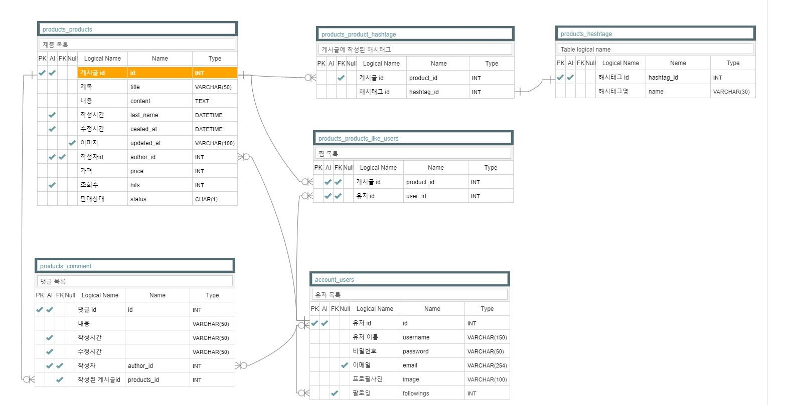
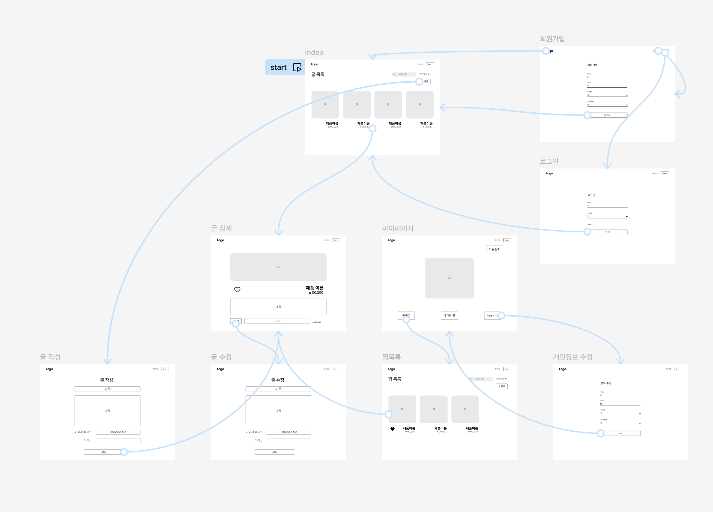

# 10$ - SPARTAMARKET

## Project Description
중고거래 플렛폼을 만드는 과제, 회원만 이용할 수 있도록 구성해야한다.

## App
### products
- 조회/등록/수정/삭제
    - 메인페이지에서 게시글 작성과 게시글의 상세페이지를 확인할 수 있고 상세페이지에서는 게시글의 수정과 삭제를 할 수 있습니다.
- 댓글작성
    - 로그인한 이용자는 게시글에 자신의 의견을 남길 수 있습니다.
- 찜하기
    - 관심있는 글을 표시하고 마이페이지에서 확인할 수 있습니다.
- 사진
    - 게시글을 작성할 때 사진을 첨부할 수 있습니다.
- 찜 횟수, 조회수
    - 이용자들이 특정 게시글을 찜한 횟수와 조회한 횟수를 확인할 수 있습니다.
- 날짜순/인기순/댓글순 정렬
    - 게시글을 날짜순, 인기순(찜 횟수순), 댓글순으로 정렬하여 게시글을 볼 수 있습니다.
- 해시태그
    - 글작성,수정시에 ','(콤마)로 구분해서 해시태그를 생성할 수 있습니다. 해당 해시태그를 클릭해서 같은 태그를 가진 글들을 볼 수 있습니다.
- 제목/내용/유저명/해시태그로 검색
    - 원하는 조건을 선택해서 게시글을 검색할 수 있습니다. (과제내용은 전체 제목, 내용, 유저명, 해시태그중 검색하는 것이었지만 검색조건을 구분하는 것이 편리할 것 같아서 따로 작성함.)
### accounts
- 회원가입
    - 회원가입을 회원의 정보를 db 저장
- 로그인/로그아웃
    - 서비스를 사용하기 위해 사용자 인증 및 접속 종료
- 회원정보수정
    - 가입한 유저들이 마이페이지에서 회원정보를 수정할 수 있습니다.
- 회원탈퇴
    - 기능설명
- 계정상세 페이지
    - 각 유저의 계정상세페이지로 이동할 수 있습니다. 이곳에서 팔로우와 계정정보 수정을 할 수 있습니다. 추가로 작성한글과 찜목록을 확인할 수 있습니다.
- 팔로우/팔로잉
    - 다른 회원의 마이페이지에 방문해서 그 회원을 팔로우할 수 있습니다. 마이페이지에서는 팔로잉한 유저들이 표시됩니다.
- 프로필사진 등록/수정
    - 마이페이지에서 프로필사진을 등록하고 수정할 수 있습니다. 사진이 등록되지 않은 유저는 기본프로필 이미지가 출력됩니다.

## ERD/Framework
- 
- 

## Troubling/Troubleshooting
- 서재일: 브랜치 생성을 잊고 dev에서 작업함.
    - 다행히 로컬환경이라 remote에 영향은 가지 않았지만 이전에 작성했던 코드를 소실하여 다시 작성하게 됨.
    
- 서재일: 게시글의 경우 데이터베이스가 로컬에 저장되기 때문에 깃허브에는 업로드 되지 않는데 게시글을 작성할 때 삽입한 이미지가 깃허브에 업로드 되는 문제가 있었음.
    - .gitignore에 이미지파일이 저장되는 경로를 추가하여 git이 해당 파일을 추적하지 않도록 설정했음.

- 서재일: 팀원의 협의가 충분히 되지 않은 상태에서 merge발생(회의중에 작성한 파일이라 제대로 검수가 이루어지지 않았음)
    - 급하게 새로운 브랜치를 생성하여 오류 수정 후 push한 뒤 팀원들에게 알림

- 서재일: 비로그인 상태에서 접속하면 안되는 페이지로 접근이 가능하여 오류 발생
    - 권한 재설정 및 예외처리

- 정성원: 상품등록시 가격이 integerField 값을 넘으면 서버 오류가 나는것을 확인 
    - 999999999을 넘으면 경고 메세지 나오는것으로 오류방지

- 정성원: 상품등록시 파일크기에 맞춰 사진이 표시되어 사진이 크다면 너무 큰 사진으로 상품 가독성에 문제가 있는것을 확인
    - style 에서 크기를 맞추고 base 에서 적용해 어디든 적용될수 있도록 하여 사진이 일정한 크기로 보이도록 함

- 정성원: 메인페이지 상품 이름 표시 시 한글은 출력이 되는데 영어 제목은 출력이 되지 않음 문제는 <> 를 태그로 인식 하였기 때문
    - &lt; html 이스케이프 활용 수정 완료

- 정성원: 로그인 된상태에서 회원가입 페이지 및 로그인 페이지로 이동가능 및 가입 로그인 중복으로 가능한 것 확인
    - 회원가입 과 로그인 뷰에 @user_passes_test 데코레이터 사용하여 로그인 중이라면 다시 인덱스로 리다이렉트 시키도록 함

- 윤찬민: 글 목록에서 사진 정렬이 왼쪽으로 되고 여백이 남음
    - mx-auto를 통해 자동으로 여백을 적용하여 이미지를 수평으로 중앙에 배치

- 임선오: 회원탈퇴 시 회원탈퇴가 되지않고 profile 화면으로 되돌아가면서 username이 회원탈퇴로 변경되는 에러가 발생
    - accounts/urls.py에서 delete를 profile, password_modify 아래에 두면서 해결

- 임선오: user_profile에 들어가면 사진 default 값을 저장해놔도 화면에 보이지않는 에러 발견
    - 로직이나 사진에는 문제없다는것을 확인 -> 이미지 주소를 accounts.image.url 해놨지만 파일에는 static/accounts안에 다른파일이 하나 더 있고 거기에 기본사진이있어 밖으로 빼면서 해결 

- 임선오: accounts앱의 User class를 사용하지않고 Profile class를 따로 구현하여 적용하려고 함. 
    - 구현까지는 완성했으나, 굳이 쓸모없는 코드가 많아 User로 병합 후 Profile을 활용하는 로직들을 수정완료

- 임선오: 팔로우 기능구현까지는 완료 했으나(print를 써서 로직이 돌아가는지 확인 및 DB확인) 화면상 숫자가 변하지않음
    - 위에 내용과 비슷하게 user와 profile 클래스를 혼용하여 user class로 병합 후 해결

## Our Team 
### 서재일
- 기본 데이터베이스 구현
- CRUD 구현 및 이미지 업로드
- 댓글작성/삭제 기능 구현
- 계정 상세페이지에 링크 및 DB 추가
- 상품찜하기, 마이페이지에서 상품 찜목록 출력
- 조회수 확인 기능
- 계정 상세페이지에 해당 회원의 찜목록과 작성글 확인 가능
- 비로그인 상태에서 로그인이 필요한 페이지로 이동하면 로그인 후에 원래 보고있던 페이지를 반환하도록함
- 해시태그 기능과 각 해시태그를 클릭해서 동일한 태그를 가지는 글을 검색할 수 있음
- 검색 기능

### 윤찬민
- 와이어프레임 제작
- 로그인,로그아웃 기능 구현
- 홈 하이퍼링크 구현
- 글 목록 정렬 기능 구현
- 글 목록 게시글 썸네일 구현 및 카드화
- 상품 찜하기 아이콘화 

### 임선오
- 회원 프로필 기능구현
- 회원 프로필 수정 기능구현
- 비밀번호 변경 기능구현
- 회원탈퇴 기능구현
- 프로필 사진 기본사진 구현
- 프로필 사진 변경 기능구현
- 팔로우기능 구현

### 정성원
- 회원가입 기능
- base.html css
- 입력값 이상 입력시 오류 수정
- 판매상태 표시 및 수정
- 리팩토링
- 페이징 기능 구현

## Version
- asgiref==3.8.1
- asttokens==2.4.1
- colorama==0.4.6
- decorator==5.1.1
- Django==4.2
- django-extensions==3.2.3
- exceptiongroup==1.2.2
- executing==2.0.1
- ipython==8.26.0
- jedi==0.19.1
- matplotlib-inline==0.1.7
- parso==0.8.4
- pillow==10.4.0
- prompt_toolkit==3.0.47
- pure_eval==0.2.3
- Pygments==2.18.0
- six==1.16.0
- sqlparse==0.5.1
- stack-data==0.6.3
- traitlets==5.14.3
- typing_extensions==4.12.2
- tzdata==2024.1
- wcwidth==0.2.13